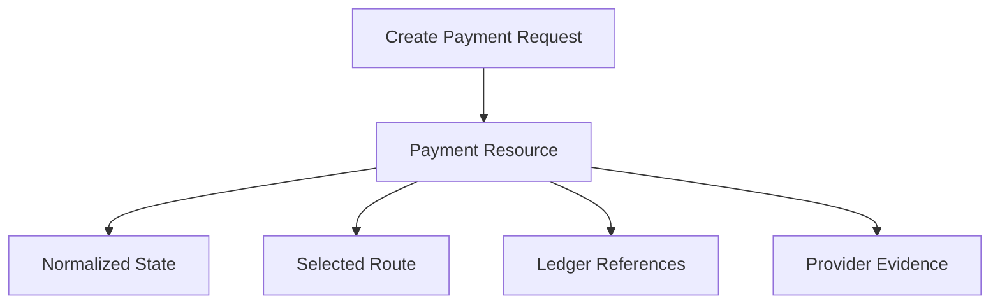

# API Overview

The API documentation starts with resource language and contract principles. Concrete endpoint definitions should be added when the thin-slice MVP is specified.

## API Principles

- APIs use platform domain language, not provider-specific terms.
- Payment creation is idempotent.
- Payment state is normalized.
- Route decisions and provider references are inspectable with appropriate authorization.
- Tenant context is explicit in authentication, authorization, or resource scope.

## Candidate Resources

- Tenant.
- Wallet.
- Account.
- Payment.
- Route.
- Provider capability.
- Ledger journal.
- Event.

## Early Payment Shape

## Deferred

- Endpoint paths.
- Authentication scheme.
- Pagination format.
- Error envelope.
- Versioning policy.
