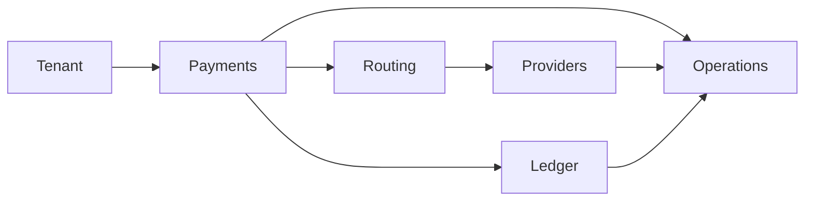

# Bounded Contexts

Bounded contexts define where models have precise meaning. They help prevent provider, ledger, tenant, and payment concerns from collapsing into one large model.

## Candidate Contexts

- Tenant Context: tenant identity, configuration, policies, and visibility boundaries.
- Payment Context: payment intent, lifecycle, state transitions, and client-facing status.
- Routing Context: capability eligibility, provider selection, and route explainability.
- Provider Context: provider adapters, provider references, capability metadata, and status evidence.
- Ledger Context: journals, entries, balances, and financial invariants.
- Operations Context: exceptions, reviews, reconciliation tasks, and manual actions.

## Context Map

## Boundary Principles

- Payment state is owned by the Payment Context.
- Financial truth is owned by the Ledger Context.
- Provider-specific details stay inside the Provider Context unless normalized.
- Route decisions are owned by the Routing Context and referenced by Payment.
- Operational workflows consume facts from other contexts but should not own their core state.
