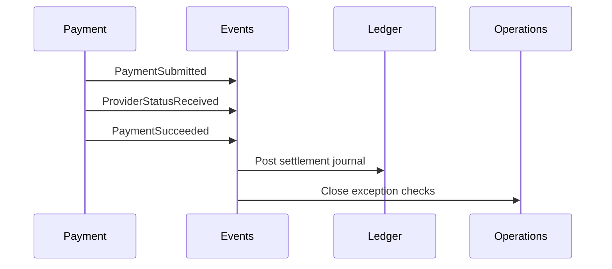

# Event-Driven Architecture

Events capture facts that other parts of the platform can react to. The initial design should define event meaning before choosing transport technology.

## Event Types

- Domain events: facts inside a bounded context, such as `PaymentAccepted` or `LedgerJournalPosted`.
- Integration events: stable events published for other contexts or external consumers.
- Provider evidence events: observations from providers that may update normalized payment state.

## Example Flow

## Event Design Rules

- Events describe facts that already happened.
- Event names use domain language.
- Events include identifiers needed for traceability and idempotency.
- Consumers must tolerate duplicate delivery and out-of-order evidence.
- Transport and broker choices are intentionally deferred.
