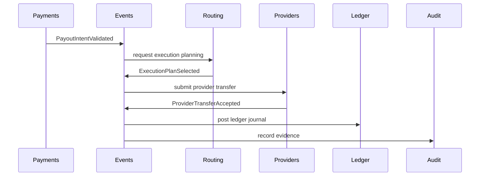

# Event Driven Architecture

## Purpose

This page defines how pay-orchestration should use events as domain facts before choosing event infrastructure.

## Overview

Events should communicate facts that have already happened. They help bounded contexts remain decoupled while preserving traceability across payment, ledger, provider, settlement, and notification workflows.

## Event Principles

- Events are named in domain language.
- Events describe facts, not commands.
- Events cross bounded contexts only when another context needs to react.
- Events should carry stable identifiers and correlation references.
- Events should support idempotent consumption.
- Event transport is not selected in this milestone.

## Event Classes

- Domain events: internal facts from a bounded context.
- Integration events: stable facts published across context boundaries.
- Evidence events: normalized facts derived from provider or webhook input.
- Audit events: facts that must be preserved for investigation.

## Future Improvements

- Define event envelope conventions.
- Define event retention and replay assumptions.
- Decide whether events are persisted before publication.

## Open Questions

- Which events are part of the stable contract for v1?
- Should command handling be synchronous while event handling is asynchronous?
- Which event failures require compensation?

## Related Documentation

- [Domain Contexts](../domain/identity.md)
- [Thin Slice Events](../thin-slice/events.md)
- [Audit Context](../domain/audit.md)
