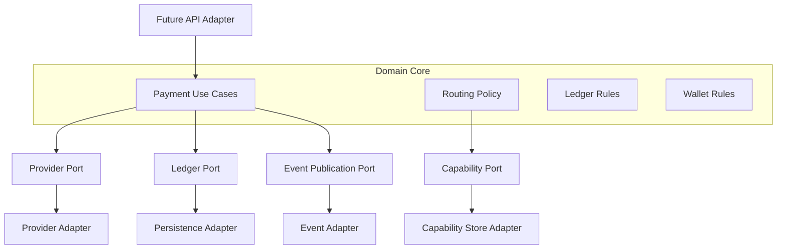

# Hexagonal Architecture

## Purpose

Hexagonal architecture keeps domain behavior independent from external systems. This page defines how pay-orchestration should use ports and adapters when implementation begins.

## Overview

The domain should speak in ontology terms: Tenant, Wallet, Payout Intent, Execution Plan, Provider Capability, Ledger Entry, and Settlement. Adapters translate between those terms and external concerns such as HTTP, persistence, provider APIs, and message transport.

## Shape

## Port Categories

- Driving ports: future APIs, internal commands, scheduled workflows.
- Driven ports: persistence, provider execution, event publication, notification delivery.
- Evidence ports: webhook ingestion, provider status polling, reconciliation imports.

## Rules

- Adapters translate external representations into domain language.
- Domain use cases should not depend on provider response shapes.
- Persistence details should not define domain entities.
- External failures should be classified before crossing into the core.

## Future Improvements

- Define port naming conventions.
- Add examples once Java code exists.
- Document module dependency enforcement.

## Open Questions

- Should each bounded context have its own application service layer?
- How should domain events be emitted without coupling to infrastructure?
- What is the right boundary between application services and domain services?

## Related Documentation

- [Architecture Overview](./overview.md)
- [Provider Plugin Model](./provider-plugin-model.md)
- [Thin Slice API](../thin-slice/api.md)
