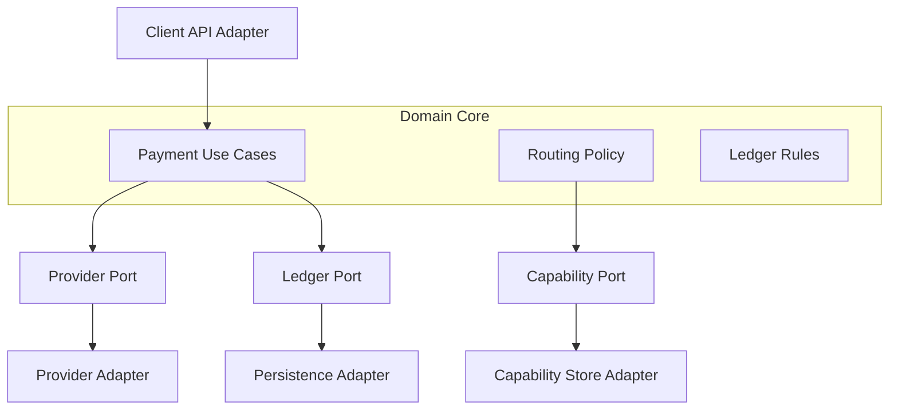

# Hexagonal Architecture

Hexagonal architecture keeps domain behavior independent from external systems. The platform core should speak in domain terms, while adapters translate to providers, persistence, clients, and messaging.

## Shape

## Ports

- Payment intake port.
- Provider execution port.
- Provider status evidence port.
- Ledger journal port.
- Capability lookup port.
- Event publication port.

## Adapter Rules

- Adapters translate external representations into domain language.
- Domain use cases should not depend on provider response shapes.
- Persistence details should not define domain entities.
- External failures should be classified before crossing into the core.
