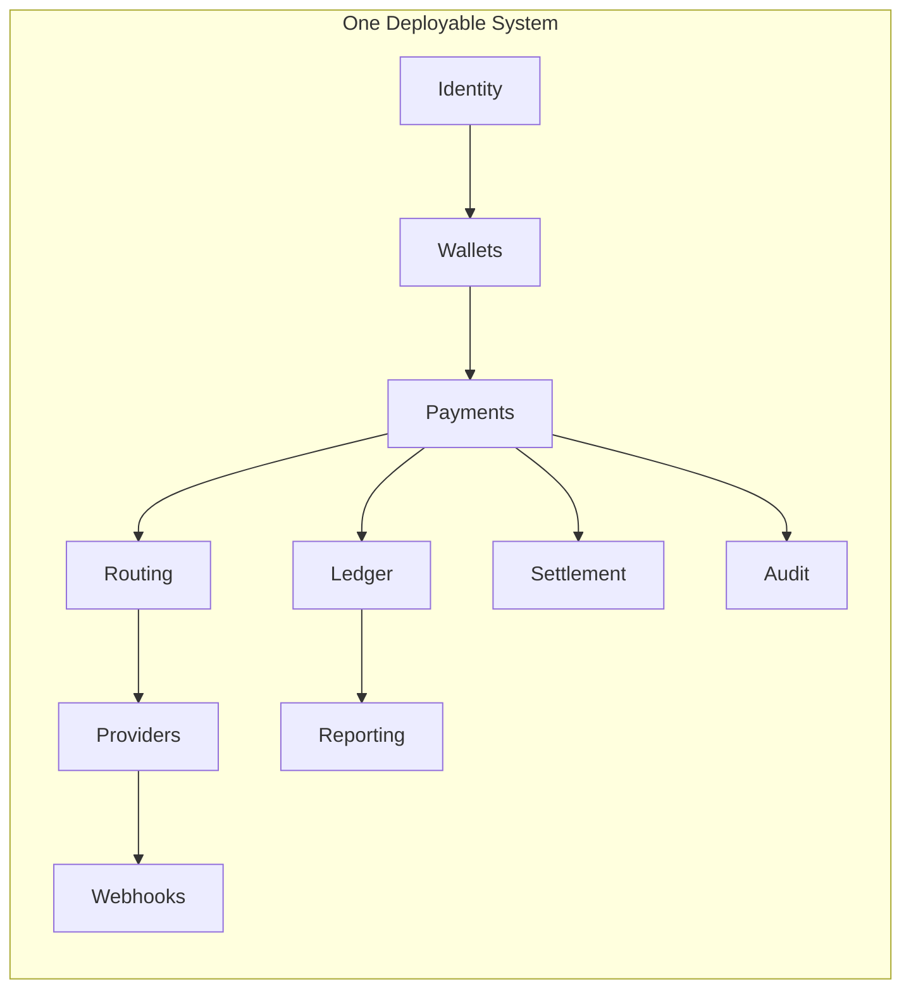

# Modular Monolith

## Purpose

This page explains why pay-orchestration should begin as a modular monolith rather than a set of microservices.

## Overview

The project has high domain uncertainty. Payment intent semantics, ledger invariants, settlement finality, provider capability modeling, and tenant isolation must be learned together. A modular monolith keeps those concepts close while still enforcing ownership boundaries.

## Design Rules

- Modules align with bounded contexts.
- Cross-module calls should use explicit application interfaces.
- Shared domain concepts must be intentional, not incidental.
- Database boundaries should be designed with future extraction in mind.
- No module should reach into another module's persistence model.

## Why Not Microservices Yet

Microservices add operational, deployment, observability, and data consistency costs. Those costs are justified only when boundaries are stable and independent scaling or ownership is proven.

## Future Improvements

- Define package/module dependency rules.
- Add architecture tests once code exists.
- Define criteria for extraction.

## Open Questions

- Which module should own shared event publication?
- Should database schemas be separated by module from the beginning?
- What is the minimum enforcement needed to keep boundaries honest?

## Related Documentation

- [Architecture Overview](./overview.md)
- [Bounded Contexts](../domain/identity.md)
- [Event Driven Architecture](./event-driven.md)
