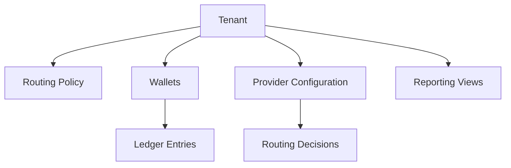

# Multi-Tenancy

## Purpose

This page defines multi-tenancy assumptions before implementation begins.

## Overview

Tenant isolation is not only authentication. It affects identity, wallet ownership, ledger views, routing policy, provider capability eligibility, reporting, and audit.

## Principles

- Every domain action should be attributable to a Tenant.
- Tenant visibility must be enforced consistently across contexts.
- Tenant policy participates in routing decisions.
- Ledger and reporting views must not mix tenant data accidentally.
- Shared provider infrastructure must not imply shared tenant visibility.

## Future Improvements

- Define tenant hierarchy policy.
- Define tenant data partitioning strategy.
- Define tenant-aware audit requirements.

## Open Questions

- Is tenant isolation logical, physical, or configurable by deployment?
- Can tenants share provider capabilities?
- How are platform-owned wallets represented?

## Related Documentation

- [Identity Context](../domain/identity.md)
- [Wallets Context](../domain/wallets.md)
- [Routing Context](../domain/routing.md)
