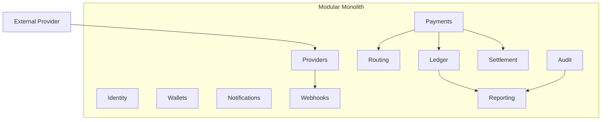

# Architecture Overview

## Purpose

This page defines the architecture direction for Milestone v0.1. It is opinionated enough to guide design, but deliberately avoids implementation artifacts.

## Overview

pay-orchestration should begin as a modular monolith implemented with Java and Spring Boot, organized by DDD bounded contexts, protected by hexagonal architecture, and connected internally through domain events.

This is not a microservices design. The project should prove domain boundaries inside one deployable system before extracting any runtime component.

## Architectural Commitments

- Start with a modular monolith, not microservices.
- Use DDD vocabulary and bounded contexts to define module ownership.
- Use hexagonal architecture to keep domain logic independent of transport, persistence, and provider details.
- Use event-driven communication for facts that cross context boundaries.
- Preserve tenant isolation as a domain concern, not only an authorization feature.
- Treat provider integrations as plugins behind stable domain ports.

## What This Architecture Avoids

- Provider-first modeling.
- Database-first modeling.
- Distributed services before domain boundaries are proven.
- Public API design before intent and lifecycle semantics stabilize.
- Infrastructure choices that obscure domain questions.

## Future Improvements

- Add ADRs for architecture commitments once the first implementation plan is ready.
- Define module dependency rules.
- Add a context-to-module map.
- Add test strategy for domain modules.

## Open Questions

- Which module owns idempotency?
- Should domain events be persisted from the first implementation?
- How strict should module boundaries be in the first code milestone?

## Related Documentation

- [Modular Monolith](./modular-monolith.md)
- [Hexagonal Architecture](./hexagonal-architecture.md)
- [Event Driven Architecture](./event-driven.md)
- [Domain Contexts](../domain/identity.md)
