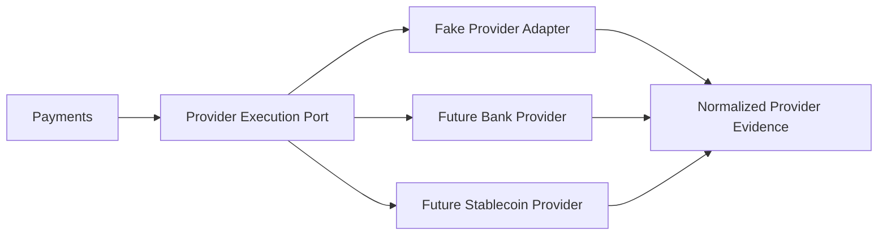

# Provider Plugin Model

## Purpose

This page defines how provider integrations should be conceptualized before implementation.

## Overview

Providers should be integrated through plugin-like adapters behind stable domain ports. The domain should depend on capabilities and normalized evidence, not provider SDKs or response shapes.

## Plugin Responsibilities

- Declare capabilities.
- Validate provider-specific requirements.
- Execute provider instructions.
- Normalize provider responses.
- Normalize webhook evidence.
- Classify provider failures.

## Plugin Non-Responsibilities

- Owning Payment Intent lifecycle.
- Posting ledger entries.
- Making routing policy decisions.
- Defining tenant visibility.

## Future Improvements

- Define provider adapter contract after the fake provider slice.
- Add provider certification checklist.
- Add capability metadata versioning.

## Open Questions

- Should capabilities be declared statically or discovered dynamically?
- Can providers be enabled per tenant?
- How should provider health affect routing?

## Related Documentation

- [Providers Context](../domain/providers.md)
- [Routing Overview](./routing-overview.md)
- [Thin Slice Scope](../thin-slice/scope.md)
