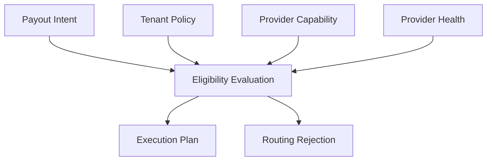

# Routing Overview

## Purpose

This page defines routing as a domain decision that selects an execution plan for an intent.

## Overview

Routing should answer: "Given this tenant, intent, asset, destination, and policy, which provider capability should execute the movement?"

## Decision Inputs

- Tenant policy.
- Intent type and amount.
- Asset and destination requirements.
- Provider capability.
- Settlement rail and network.
- Provider availability.
- Operational constraints.

## Decision Outputs

- Execution Plan when routing succeeds.
- Routing rejection reason when no route is available.
- Decision evidence for audit and debugging.

## Future Improvements

- Define route scoring.
- Add fallback routing.
- Add cost and speed trade-offs.
- Add routing simulation for operations.

## Open Questions

- Should routing be deterministic for the same inputs?
- How should manual route override work?
- Which routing evidence is required for audit?

## Related Documentation

- [Routing Context](../domain/routing.md)
- [Provider Capability](../ontology/entities.md#provider-capability)
- [Thin Slice Sequence](../thin-slice/sequence.md)
