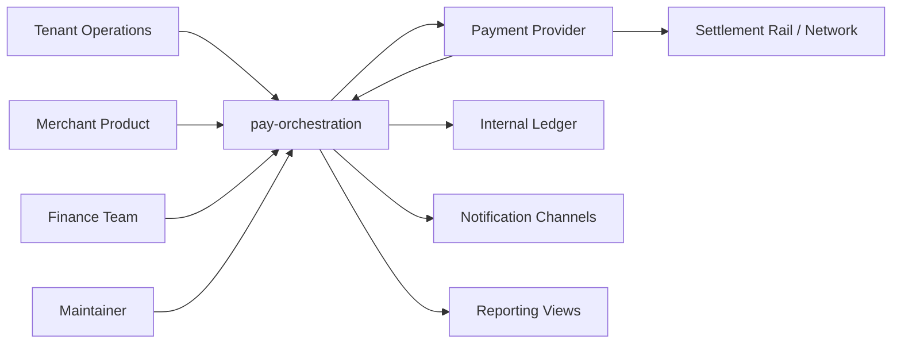

# System Context

## Purpose

This page defines pay-orchestration's position relative to external actors and systems.

## Overview

The system coordinates value movement for tenants. It interacts with providers, receives webhooks, records ledger facts, and emits notifications and reporting views.

## External Actors

- Tenant operators: configure and monitor payment activity.
- Product systems: request value movement.
- Finance teams: reconcile money movement.
- Providers: execute transfers and send evidence.
- Maintainers: evolve the platform safely.

## System Responsibilities

- Normalize intent and provider evidence.
- Coordinate execution plans.
- Preserve ledger and audit traceability.
- Expose reporting and notifications.

## Future Improvements

- Add threat model.
- Add compliance boundary diagram.
- Add operational support scenarios.

## Open Questions

- Which actors are in scope for the first implementation?
- Is finance a system actor or human workflow first?
- Which external systems are required for the fake provider slice?

## Related Documentation

- [Product Vision](../product-vision.md)
- [Thin Slice Vision](../thin-slice/vision.md)
- [Webhooks Context](../domain/webhooks.md)
