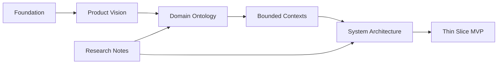
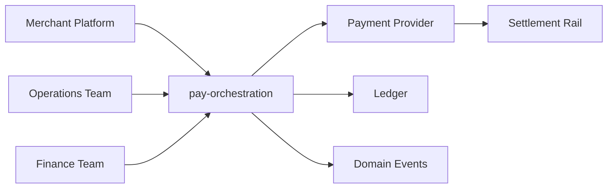

# pay-orchestration Documentation Milestone v0.1

pay-orchestration is a documentation-first open source project for payment orchestration. Milestone v0.1 establishes the language, boundaries, and architectural posture needed before implementation begins.

This milestone does not design the whole platform. It defines enough shared understanding to make the first implementation slice deliberate rather than accidental.

## Purpose

This documentation answers questions in the order the project should reason about them:

1. Why are we building this?
2. What language does the business use?
3. What problems are we solving?
4. How is the system divided?
5. What is the smallest thing we can build?

## Overview

Milestone v0.1 is an engineering foundation. It establishes product intent, domain language, bounded contexts, architectural direction, thin-slice scope, and research tracks before implementation begins.

## Reader Paths

- Start with [Product Vision](./product-vision.md) to understand the project intent and non-goals.
- Read [Ontology Overview](./ontology/overview.md) and [Ontology Glossary](./ontology/glossary.md) to learn the business language.
- Read [Domain Contexts](./domain/identity.md) to understand ownership boundaries.
- Read [Architecture Overview](./architecture/overview.md) to understand the intended system shape.
- Read [Thin Slice Vision](./thin-slice/vision.md) to understand the first build target.
- Use [Research Notes](./research/payment-orchestration.md) as expandable background, not as binding decisions.

## Documentation Map

## System Context

## Milestone Scope

Milestone v0.1 includes:

- Product vision and non-goals.
- Domain ontology and glossary.
- Bounded context definitions.
- Architecture direction using DDD, hexagonal architecture, event-driven design, and a modular monolith.
- Thin-slice MVP definition.
- Research notes for long-term study.

It intentionally excludes Java code, Spring Boot code, provider integrations, Docker files, Kubernetes manifests, production database schemas, and public APIs.

## Future Improvements

- Add ADRs for decisions accepted during implementation planning.
- Link research notes to concrete design decisions when those decisions are made.
- Expand the ontology with examples from real payout, settlement, and reconciliation scenarios.

## Open Questions

- Which legal and compliance boundaries must influence the first implementation?
- Which provider class should the fake provider emulate first: bank, mobile money, stablecoin, or internal ledger?
- How much accounting rigor is required in the first ledger slice?

## Related Documentation

- [Product Vision](./product-vision.md)
- [Ontology Overview](./ontology/overview.md)
- [Architecture Overview](./architecture/overview.md)
- [Thin Slice Vision](./thin-slice/vision.md)
