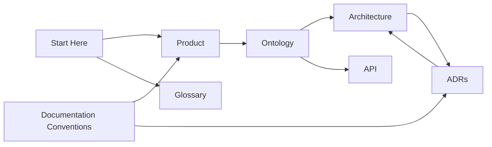
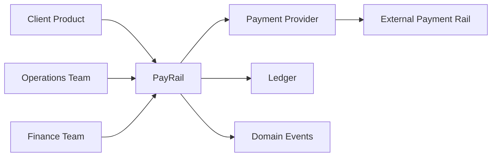

# PayRail Engineering Docs

PayRail is a docs-first engineering portal for payment orchestration. It captures product intent, domain language, architecture decisions, API direction, and operating conventions before implementation choices harden.

The goal is to make the system understandable to product, engineering, finance, and operations teams from the first commit.

## Reader Paths

- Product and business readers: start with [Product vision](./product/vision.md), then [Build phases](./product/build-phases.md).
- Engineers: start with [Ontology overview](./ontology/overview.md), then [Bounded contexts](./architecture/bounded-contexts.md).
- Architecture reviewers: start with the [ADR index](./adrs/index.md).
- Contributors: read the [Contribution guide](./contributing.md) and [Documentation conventions](./documentation-conventions.md).
- New readers: keep the [Glossary](./glossary.md) open while reading.

## Documentation Map

## System Context

## What Belongs Here

- Domain concepts that shape product and API decisions.
- Architecture decisions that need review or historical context.
- Diagrams that explain payment, ledger, provider, tenant, and event flows.
- Operational assumptions that affect engineering design.
- Contribution rules for maintaining the documentation as a serious source of truth.

## Current Scope

This repository currently contains documentation only. It intentionally does not include application code, infrastructure manifests, deployment configuration, or provider-specific runtime integrations.
