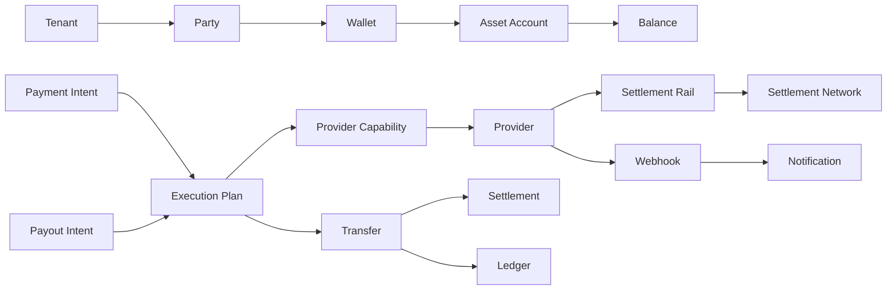

# Ontology Overview

## Purpose

The ontology defines the business language of pay-orchestration. It is not an API model, database schema, or class hierarchy. It is the vocabulary used to reason about the domain.

## Overview

Payment orchestration sits between parties that want value moved and providers that can execute value movement. The core model separates intent, planning, execution, settlement, notification, and ledger recording.

## Concept Families

- Identity concepts: Tenant, Party.
- Value concepts: Asset, Wallet, Asset Account, Balance.
- Movement concepts: Payment Intent, Payout Intent, Transfer, Settlement.
- Execution concepts: Provider, Provider Capability, Settlement Rail, Settlement Network, Execution Plan.
- Communication concepts: Webhook, Notification.
- Financial record concepts: Ledger and Ledger Entry.

## Modeling Rules

- Intent describes desired business outcome.
- Execution plan describes how the system intends to achieve it.
- Transfer describes an attempted or completed movement.
- Settlement describes finality or clearing across a rail or provider.
- Ledger records internal financial truth.
- Webhooks are provider evidence, not domain truth by themselves.

## Future Improvements

- Add example scenarios for payout, pay-in, reversal, and failed settlement.
- Add invariants for ledger and balance derivation.
- Add mapping from ontology concepts to bounded contexts.

## Open Questions

- Should Payment Intent include pay-in and transfer use cases, or should each intent type be explicit?
- What level of custody is assumed for Wallet and Asset Account?
- How should provider status evidence be reconciled with ledger finality?

## Related Documentation

- [Entities](./entities.md)
- [Value Objects](./value-objects.md)
- [Relationships](./relationships.md)
- [Payment Lifecycle](./payment-lifecycle.md)
- [Glossary](./glossary.md)
