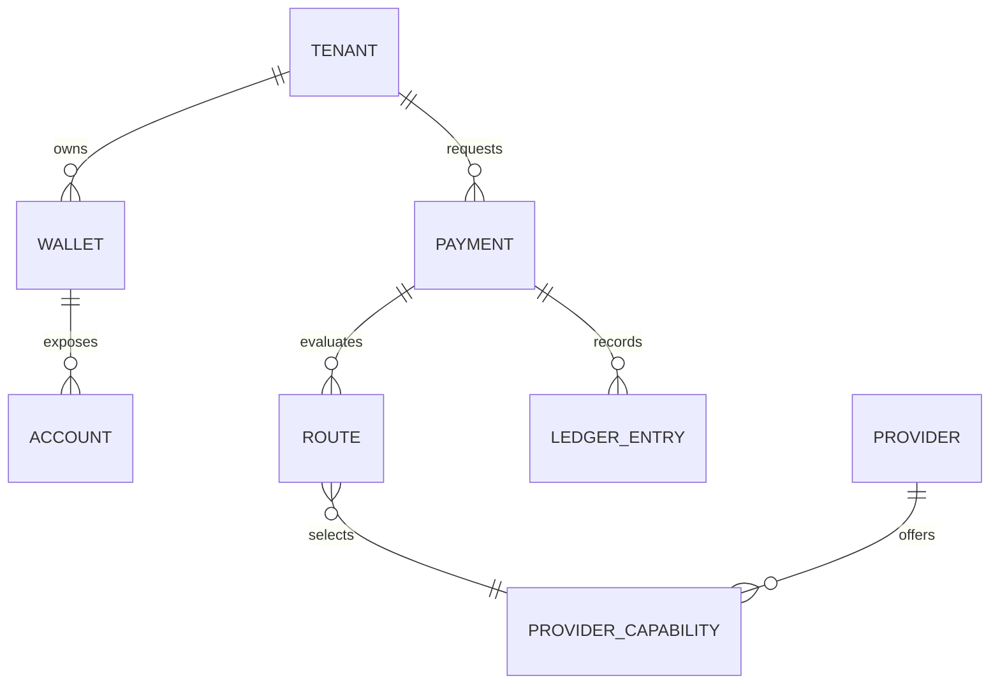

# Ontology Overview

The ontology defines the words the platform uses for product behavior, API contracts, events, ledger records, and operational reporting.

## Core Concepts

- Tenant: an isolated business customer or platform participant using orchestration capabilities.
- Payment: a requested movement of value from a source to a destination.
- Wallet: a balance container owned within the platform domain.
- Account: an addressable financial endpoint used to fund or receive payments.
- Ledger: the authoritative record of financial movements.
- Provider: an external party that executes a payment capability.
- Capability: a provider's declared support for a country, currency, rail, direction, and destination type.
- Route: the selected path for a payment through a provider capability.
- Event: a durable fact about a domain state change.

## Relationship Map

## Modeling Rules

- Internal states must be stable even when provider states differ.
- Money movement is not complete until the ledger records it.
- Provider capabilities are data, not application branches.
- Tenant boundaries apply to configuration, balances, visibility, and operations.
