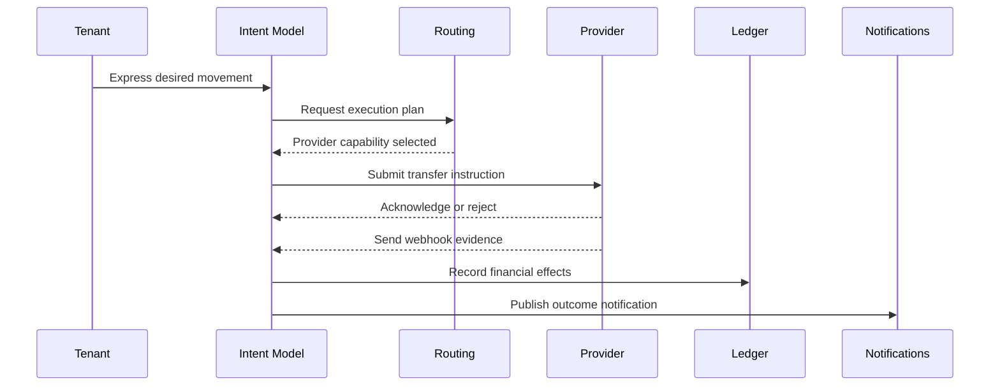

# Payment Lifecycle

## Purpose

This page defines the business lifecycle of a payment movement without specifying APIs, tables, or provider implementations.

## Overview

The lifecycle begins with intent and ends with either finality, failure, cancellation, or reversal. Providers may report intermediate evidence, but the platform decides normalized state.

## Lifecycle Stages

- Requested: a business actor asks for value movement.
- Validated: the request satisfies domain requirements.
- Planned: routing selects an execution path.
- Submitted: the selected provider or internal mechanism receives the instruction.
- Processing: external or internal execution is underway.
- Settled: settlement finality is observed or inferred.
- Failed: execution cannot complete.
- Cancelled: the request is stopped before terminal execution.
- Reversed: a previously settled movement is undone or compensated.

## Examples

- A merchant requests a payout to a beneficiary bank account.
- A platform moves value from a merchant wallet to a settlement account.
- A fake provider emits a webhook indicating payout completion.

## Relationships

The lifecycle crosses Payments, Routing, Providers, Ledger, Settlement, Notifications, Webhooks, Audit, and Reporting contexts.

## Future Improvements

- Add lifecycle variants for pay-in, internal transfer, and reversal.
- Define state transition invariants.
- Map lifecycle stages to context-owned events.

## Open Questions

- Which states require ledger entries?
- Which webhook evidence is sufficient for settlement?
- Should reversal be a state transition or a new compensating movement?

## Related Documentation

- [State Machines](./state-machines.md)
- [Thin Slice Sequence](../thin-slice/sequence.md)
- [Event Driven Architecture](../architecture/event-driven.md)
