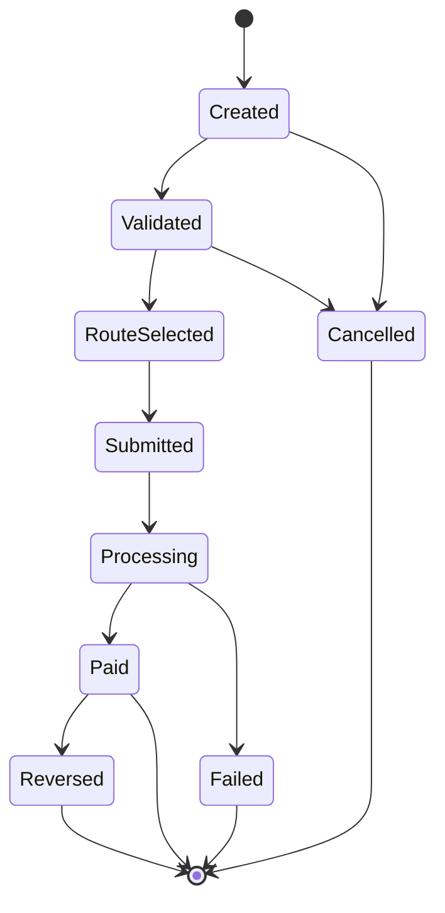

# Payment State Ontology

Payment state must describe the platform's understanding of the payment lifecycle, not simply mirror provider status labels.

## Normalized States

- Draft: the payment has been prepared but not submitted.
- Accepted: the platform has accepted the request for processing.
- Routing: the platform is evaluating eligible capabilities.
- Submitted: the instruction has been sent to a provider.
- Processing: the provider or rail is still working on the instruction.
- Succeeded: the payment reached its intended terminal success condition.
- Failed: the payment reached a terminal failure condition.
- Cancelled: the payment was stopped before terminal execution.
- Reversed: a previously successful movement was undone.

## Payout Intent Lifecycle

This diagram uses payout-intent language to show the common happy path and the main terminal outcomes. Provider-specific statuses should map into these platform states rather than replacing them.

## Mapping Rules

- Provider statuses are evidence used to update normalized state.
- Terminal states require idempotent handling.
- Ambiguous provider responses should remain non-terminal until resolved.
- State transitions should emit domain events for audit and downstream workflows.
