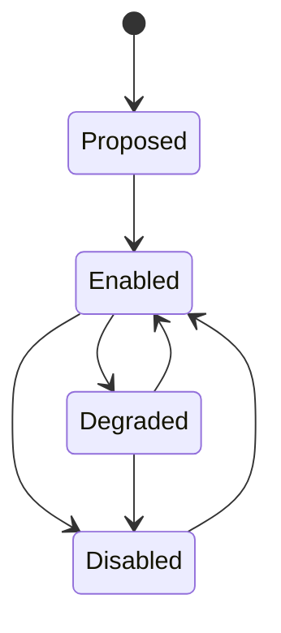

# Provider Capability Model

A provider capability describes what an external provider can do under specific conditions. Routing should depend on capabilities rather than provider names alone.

## Capability Dimensions

- Provider.
- Country or region.
- Currency.
- Direction, such as pay-in or pay-out.
- Rail, such as bank transfer, card, or mobile money.
- Destination type.
- Minimum and maximum amount.
- Availability window.
- Settlement behavior.
- Required fields.
- Supported idempotency and reference semantics.

## Capability Lifecycle

## Routing Use

The routing context should evaluate:

- Tenant policy.
- Payment intent.
- Capability support.
- Provider health.
- Amount and currency limits.
- Compliance and operational restrictions.

The selected route should be recorded so the payment remains explainable after execution.
