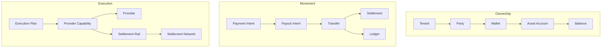

# Relationships

## Purpose

This page describes the relationships between major domain concepts. These relationships guide modeling but do not define database tables or APIs.

## Overview

The domain has three main relationship chains: ownership, movement, and execution.

## Key Relationships

- Tenant owns policy and visibility boundaries.
- Party participates in payment activity and can own Wallets.
- Wallet groups Asset Accounts by owner and purpose.
- Asset Account is the accounting focus for a specific Asset.
- Intent expresses desired outcome.
- Execution Plan explains how the system will attempt that outcome.
- Provider Capability constrains what is possible.
- Transfer records execution movement.
- Settlement records external or internal finality.
- Ledger records financial truth.
- Webhook supplies asynchronous provider evidence.
- Notification communicates domain events.

## Relationship Principles

- Provider data can annotate domain relationships but should not own them.
- Ledger relationships should be traceable to business intent.
- Execution relationships should remain explainable after failure.
- Settlement relationships should distinguish submission, processing, and finality.

## Future Improvements

- Add relationship cardinality after implementation discovery.
- Add examples for split payouts and fallback routing.
- Add relationship constraints for tenant isolation.

## Open Questions

- Can a Payout Intent create multiple Transfers?
- Can one Settlement cover multiple Transfers?
- Should Notification link to source events only, or directly to domain entities?

## Related Documentation

- [Entities](./entities.md)
- [Payment Lifecycle](./payment-lifecycle.md)
- [Routing Overview](../architecture/routing-overview.md)
