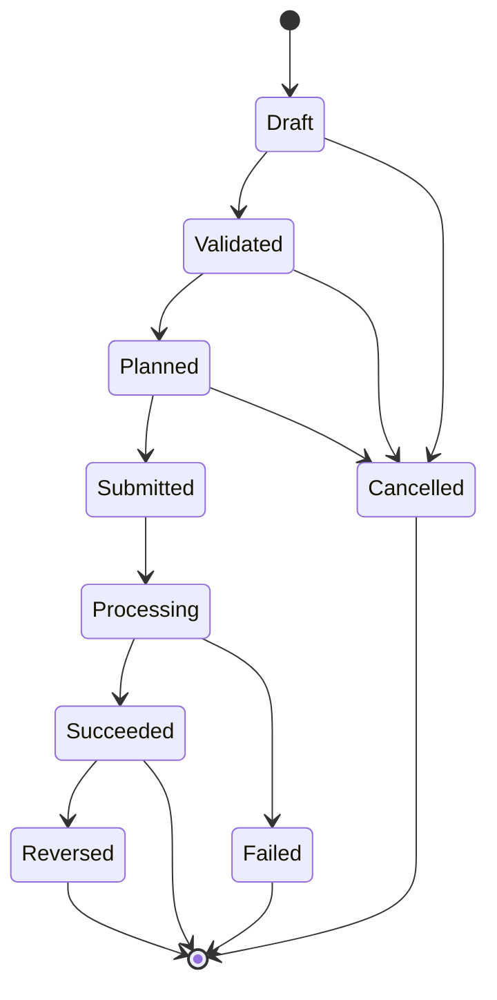
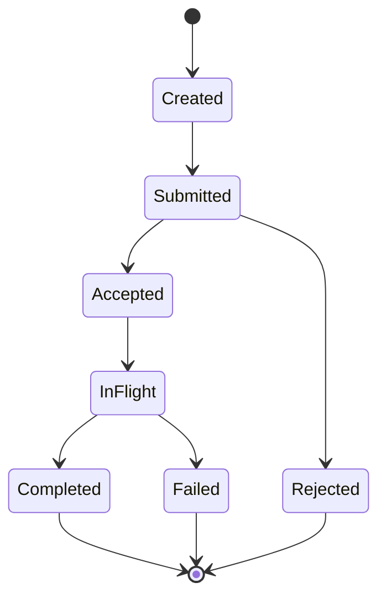
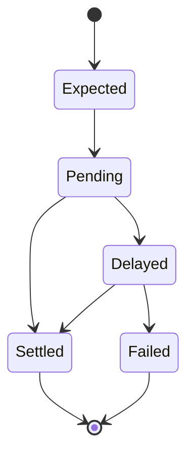

# State Machines

## Purpose

This page documents candidate state machines for the domain. These are conceptual models for review, not implementation enums.

## Overview

State machines should describe domain truth in stable language. Provider statuses may be mapped into these states, but should not define them.

## Payout Intent State Machine

## Transfer State Machine

## Settlement State Machine

## Examples

- A provider accepts a payout but settles it later.
- A payout succeeds but later requires reversal.
- A webhook reports a failed provider transfer after submission.

## Relationships

Intent state should coordinate business outcome. Transfer state should describe execution. Settlement state should describe finality. Ledger entries should be tied to the correct state transition.

## Future Improvements

- Add transition guards and invariants.
- Add state ownership per bounded context.
- Validate state names against real provider evidence.

## Open Questions

- Should `Succeeded` require settlement or only successful provider execution?
- Are transfer failure and intent failure always the same?
- Which states are visible to tenants?

## Related Documentation

- [Payment Lifecycle](./payment-lifecycle.md)
- [Thin Slice Events](../thin-slice/events.md)
- [Providers Context](../domain/providers.md)
