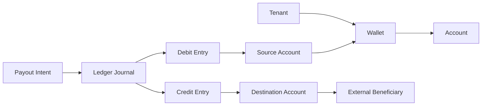

# Wallet, Account, and Ledger Model

Wallets, accounts, and ledgers solve different problems and should not be collapsed into one concept.

## Wallet

A wallet is a tenant-scoped balance container. It represents value held or managed by the platform for a specific purpose, currency, and owner.

Examples:

- Tenant operating wallet.
- Customer stored-value wallet.
- Settlement suspense wallet.
- Fee collection wallet.

## Account

An account is an addressable endpoint for funding or receiving value. It may be internal or external.

Examples:

- Internal wallet account.
- Bank account destination.
- Mobile money destination.
- Provider settlement account.

## Ledger

The ledger is the authoritative record of financial facts. It records balanced journal entries that explain how value moved between accounts.

## Model

## Invariants

- A wallet balance is derived from ledger entries, not manually adjusted.
- Every ledger journal balances by currency.
- Accounts identify where value is debited or credited.
- Provider references can annotate ledger entries but do not replace them.
