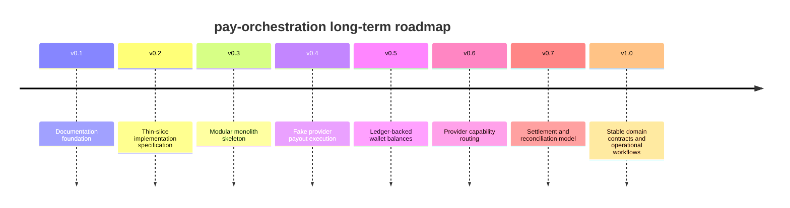

# Product Vision

## Purpose

This page defines why pay-orchestration exists and what the project will optimize for. It is the reference point for scope decisions, architectural trade-offs, and future implementation planning.

## Overview

The product vision is intentionally domain-focused. It defines the problem space and long-term direction without committing the project to APIs, persistence, deployment topology, or provider integrations.

## Vision

pay-orchestration should become a reliable open source foundation for describing, routing, executing, observing, and reconciling movements of value across providers, assets, rails, and tenants.

The project should help engineering teams reason about payments as a domain rather than as a pile of provider integrations.

## Mission

Build a documentation-led, domain-driven payment orchestration system that can evolve from a modular monolith into a mature infrastructure platform without losing correctness, auditability, or conceptual clarity.

## Goals

- Establish precise business language for wallets, accounts, intents, ledgers, providers, settlement, and routing.
- Make provider selection explicit through capabilities and execution plans.
- Treat ledger integrity and auditability as first-order product requirements.
- Support multi-tenant isolation in the domain model from the beginning.
- Keep the first implementation small enough to validate the model.
- Preserve optionality for future rails, assets, and provider types without abstracting too early.

## Non-Goals

- Building a universal payment gateway in the first milestone.
- Implementing real provider integrations before the domain model is stable.
- Supporting every payment method, currency, or jurisdiction.
- Optimizing for microservice extraction before modular boundaries are proven.
- Designing public APIs before the language and lifecycle are understood.

## Target Users

- Platform engineers building payment infrastructure.
- Product teams that need predictable payout and wallet primitives.
- Finance teams that need auditable money movement.
- Operations teams that need traceable execution and failure states.
- Open source contributors interested in payment domain modeling.

## Core Principles

- Domain first: terminology and invariants precede implementation.
- Ledger before convenience: financial truth must not depend on provider status labels.
- Explicit boundaries: each context owns its model and publishes facts to others.
- Provider humility: provider behavior is evidence, not the source of the internal domain.
- Thin slices: build one coherent flow before adding breadth.
- Iterative rigor: evolve the design through ADRs and research notes.

## Design Philosophy

The project should favor boring architecture, clear naming, and reversible decisions. The initial architecture assumes Java, Spring Boot, DDD, hexagonal architecture, event-driven design, and a modular monolith. Those assumptions guide future implementation, but this milestone does not create implementation artifacts.

The system should be designed so a developer can answer three questions before changing code:

- Which domain concept am I changing?
- Which bounded context owns it?
- Which events or invariants might be affected?

## Long-Term Roadmap

## What Success Looks Like

- Contributors use the same language when discussing payment flows.
- The first implementation slice is small, testable, and grounded in the ontology.
- Provider integrations can be added without rewriting core payment concepts.
- Ledger and audit concepts remain understandable under failure and reversal scenarios.
- Research notes inform decisions without becoming unreviewed requirements.

## What the Project Intentionally Will Not Do

- It will not hide domain complexity behind vague "payment status" fields.
- It will not treat provider APIs as the domain model.
- It will not skip ledger semantics for faster demos.
- It will not introduce distributed systems complexity before module boundaries prove they need extraction.
- It will not create production payment software before legal, compliance, and operational responsibilities are understood.

## Future Improvements

- Add explicit product personas and operational scenarios.
- Create a decision map from product goals to architecture choices.
- Add a risk register for compliance, settlement, reconciliation, and custody assumptions.

## Open Questions

- Should the project model stored value, pass-through orchestration, or both?
- Which asset types are in scope for v1: fiat only, stablecoins, internal points, or multiple asset classes?
- How should compliance responsibilities be represented without over-modeling jurisdiction-specific law?

## Related Documentation

- [Ontology Overview](./ontology/overview.md)
- [Architecture Overview](./architecture/overview.md)
- [Thin Slice Vision](./thin-slice/vision.md)
