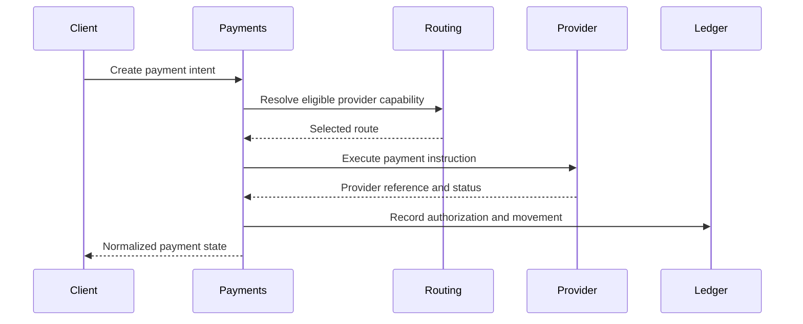

# Thin-Slice MVP

The MVP should prove one complete payment journey instead of many partial abstractions.

## Scope

The thin slice covers:

- One tenant.
- One payment product.
- One source wallet or account.
- One destination type.
- One provider capability.
- One normalized payment lifecycle.
- One ledger journal path.

## Workflow

## Success Criteria

- A payment can be requested, accepted, executed, tracked, and finalized.
- Internal state is expressed in platform terms, not provider-specific terms.
- Ledger entries can explain the money movement.
- The route decision can be inspected after the fact.
- Failures produce actionable classifications.

## Explicit Deferrals

- Multiple providers.
- Advanced retry orchestration.
- Multi-rail routing optimization.
- Settlement reconciliation.
- Manual operations workflows.
