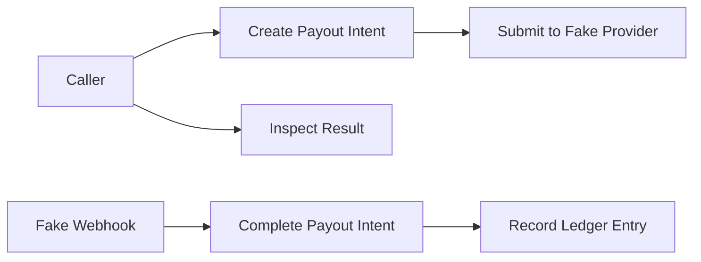

# Thin Slice API

## Purpose

This page describes the minimum interactions the thin slice must support. It does not define URLs, JSON schemas, SDKs, or stable public contracts.

## Overview

The first implementation needs a way to express the payout flow. The exact API design should wait until the domain lifecycle is accepted.

## Required Interactions

- Register or seed a Tenant.
- Register or seed a Wallet.
- Register or seed an Asset Account.
- Request a Payout Intent.
- Simulate Fake Provider completion.
- Inspect Payout Intent state.
- Inspect Ledger Entry result.

## API Principles

- Use domain language from the ontology.
- Do not expose provider internals as primary concepts.
- Make idempotency explicit when implementation begins.
- Keep tenant context visible in every interaction.

## Future Improvements

- Define actual endpoints or commands during the implementation milestone.
- Add error taxonomy after state-machine decisions are accepted.
- Add examples once the fake provider behavior is finalized.

## Open Questions

- Should the first interface be HTTP, command-line, test fixture, or internal application service?
- How should tenant context be supplied?
- Which errors should be visible to callers?

## Related Documentation

- [Ontology Glossary](../ontology/glossary.md)
- [Payout Intent State Machine](../ontology/state-machines.md#payout-intent-state-machine)
- [Hexagonal Architecture](../architecture/hexagonal-architecture.md)
