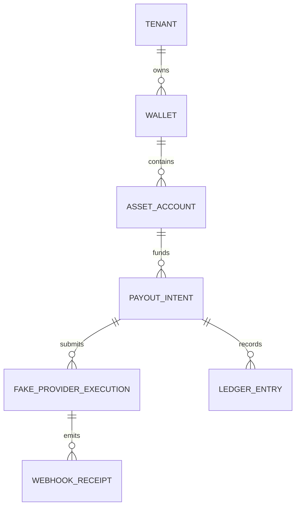

# Thin Slice Database

## Purpose

This page documents the conceptual data that must be persisted in the thin slice. It is not a database schema.

## Overview

The thin slice needs enough persistence to replay the story of a payout: who requested it, from which asset account, through which fake provider reference, with which webhook evidence, and which ledger entry resulted.

## Conceptual Records

- Tenant record.
- Wallet record.
- Asset Account record.
- Payout Intent record.
- Fake Provider execution record.
- Webhook receipt record.
- Ledger Entry record.

## Persistence Principles

- Persist enough identifiers to correlate the full flow.
- Preserve raw webhook evidence in some form.
- Keep provider references separate from domain identifiers.
- Do not optimize schema for future provider breadth yet.

## Future Improvements

- Convert conceptual records into implementation schema only during the code milestone.
- Add idempotency records if needed.
- Add audit records after event and audit decisions are accepted.

## Open Questions

- Should ledger entries be single-sided in the very first slice or double-entry from day one?
- Is raw webhook evidence required for fake provider?
- Should payout intent and transfer be separate persisted concepts in the thin slice?

## Related Documentation

- [Ledger Context](../domain/ledger.md)
- [Thin Slice Scope](./scope.md)
- [Ledger Systems Research](../research/ledger-systems.md)
