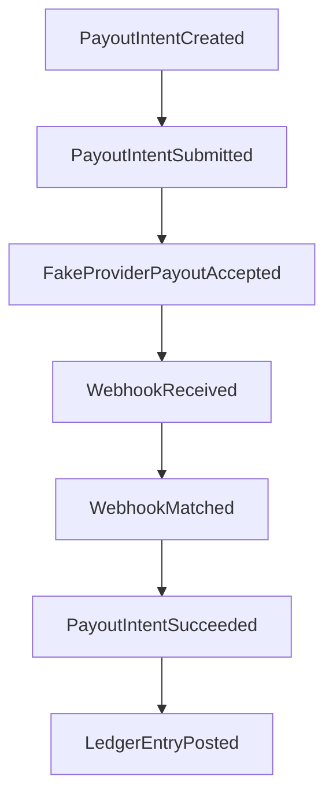

# Thin Slice Events

## Purpose

This page defines the candidate events needed to describe the thin-slice payout flow.

## Overview

Events should be domain facts. The first slice can keep event handling in-process, but event names and meanings should be stable enough to discuss.

## Candidate Events

- `TenantCreated`
- `WalletCreated`
- `AssetAccountOpened`
- `PayoutIntentCreated`
- `PayoutIntentSubmitted`
- `FakeProviderPayoutAccepted`
- `WebhookReceived`
- `WebhookMatched`
- `PayoutIntentSucceeded`
- `LedgerEntryPosted`

## Event Flow

## Future Improvements

- Decide event envelope structure.
- Decide whether events are persisted.
- Add failure and duplicate webhook events.

## Open Questions

- Is `FakeProviderPayoutAccepted` a provider event or a domain event?
- Does `LedgerEntryPosted` happen after `PayoutIntentSucceeded` or before it?
- Which events must be visible in audit?

## Related Documentation

- [Event Driven Architecture](../architecture/event-driven.md)
- [Thin Slice Sequence](./sequence.md)
- [Audit Context](../domain/audit.md)
