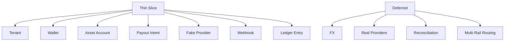

# Thin Slice Scope

## Purpose

This page prevents the first implementation from becoming a platform rewrite.

## Overview

The first slice should prove a single happy path and one failure path. It should produce enough behavior to validate the domain model and architecture boundaries.

## In Scope

- Create a Tenant.
- Create a Wallet for that Tenant.
- Create an Asset Account for one Asset.
- Create a Payout Intent against that Asset Account.
- Select the Fake Provider as the only execution option.
- Simulate provider completion through a Webhook.
- Record one or more Ledger Entries explaining the movement.

## Out of Scope

- Real bank, mobile money, card, or stablecoin provider behavior.
- Public API design commitments.
- FX.
- Multiple assets.
- Multiple tenants in one workflow.
- Advanced routing.
- Reconciliation.
- User interface.

## Domain Boundary

## Future Improvements

- Add a thin-slice risk register.
- Split the thin slice into vertical tickets when implementation begins.
- Define sample data for walkthroughs.

## Open Questions

- What is the single Asset used in the slice?
- Does the first slice require balance reservation?
- How should duplicate webhook delivery be represented?

## Related Documentation

- [Thin Slice Vision](./vision.md)
- [Thin Slice Database](./database.md)
- [Payout Intent State Machine](../ontology/state-machines.md#payout-intent-state-machine)
