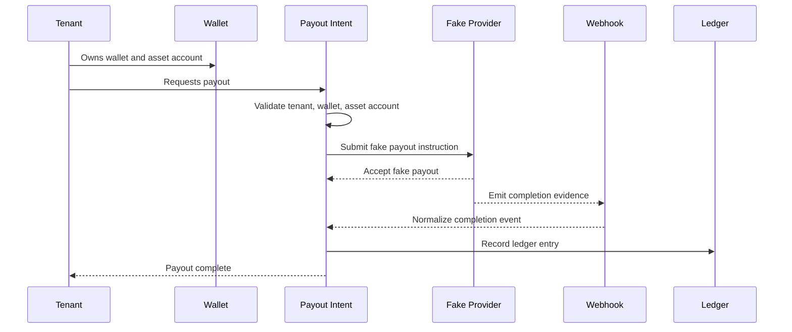

# Thin Slice Sequence

## Purpose

This page shows the order of domain interactions for the first payout flow.

## Overview

The sequence is intentionally small. It is not a public API contract or implementation trace.

## Expected Outcomes

- The payout intent reaches a terminal success or failure state.
- The fake provider reference is traceable.
- The webhook can be matched to the payout.
- The ledger entry explains the financial effect.

## Future Improvements

- Add retry and duplicate webhook scenarios.
- Add failure sequence.
- Add audit recording once audit enters the implementation slice.

## Open Questions

- Does ledger recording happen before or after webhook completion?
- Should provider acceptance create a pending ledger entry?
- How should webhook evidence be stored in the first slice?

## Related Documentation

- [Thin Slice Events](./events.md)
- [Payment Lifecycle](../ontology/payment-lifecycle.md)
- [Webhooks Context](../domain/webhooks.md)
